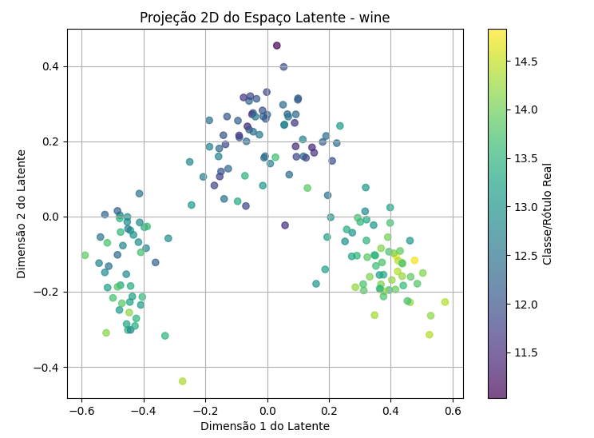
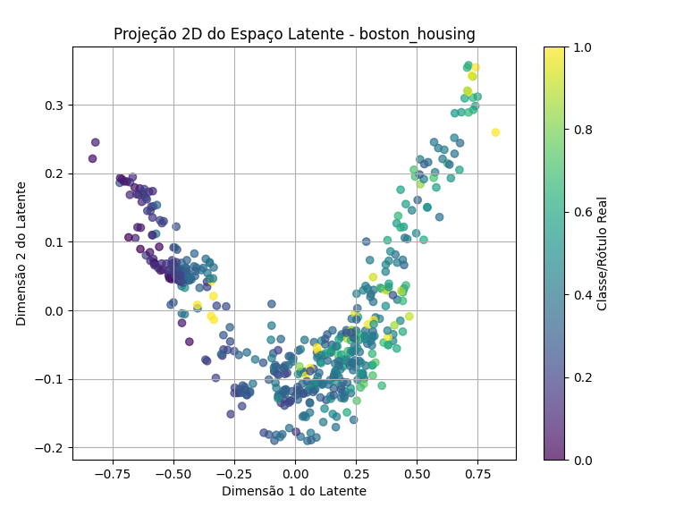

# 🔥 VAE Latent Space Exploration 🔥

Este projeto tem como objetivo explorar o comportamento de **Variational Autoencoders (VAEs)** em diferentes **datasets rotulados**, analisando a organização dos dados no **espaço latente** e sua relação com os rótulos originais.

---

## 📌 Objetivos do Projeto

- **Treinar modelos VAEs** em dois datasets rotulados distintos.
- **Ajustar a melhor topologia** do modelo com base na função de custo e conjunto de validação.
- **Explorar o espaço latente** gerado pelo VAE, analisando a formação de clusters e separação de rótulos.
- **Gerar visualizações em 2D** usando **PCA**, verificando a explicabilidade da variância e a estrutura dos dados.

---

## 📂 Estrutura do Projeto

```bash
vae-latent-space/
│── data/
│   ├── boston_housing.csv      # Dataset de preços de imóveis
│   ├── wine.csv                # Dataset de classificação de vinhos
│── models/
│   ├── vae_boston_housing.pt   # Modelo treinado para Boston Housing
│   ├── vae_wine.pt             # Modelo treinado para Wine
│── src/
│   ├── dataset.py              # Função de carregamento dos datasets
│   ├── train_wine.py           # Treinamento do VAE no dataset Wine
│   ├── train_boston.py         # Treinamento do VAE no dataset Boston Housing
│   ├── evaluate_wine.py        # Avaliação e projeção do espaço latente do Wine
│   ├── evaluate_boston.py      # Avaliação e projeção do espaço latente do Boston Housing
│   ├── test_latent_space.py    # Teste do espaço latente (clusters, separação e variância)
│   ├── vae.py                  # Implementação da arquitetura do VAE
│── README.md                   # Documentação do projeto

```

---

## 📊 Datasets Utilizados

### 📌 1️⃣ Wine Dataset
- **Conjunto de dados pequeno** (*178 amostras*).
- **Classificação de vinhos** baseada em características químicas.
- **Tarefa:** Classificação multi-classe.

### 📌 2️⃣ Boston Housing Dataset
- **Conjunto de dados de preços de casas** (*506 amostras*).
- **Predição do valor dos imóveis** com base em fatores socioeconômicos e estruturais.
- **Tarefa:** Regressão.

---

## 🏗️ Estrutura do Modelo VAE

Os VAEs implementados seguem a seguinte estrutura:

### **Encoder**
- Camadas densas com ativação **ReLU**.
- Projeção para **espaço latente** de dimensão ajustável (**default: `LATENT_DIM = 32`**).

### **Decoder**
- Camadas espelhadas ao **encoder**.
- Saída reconstruída para o espaço original dos dados.

### **Treinamento**
- **Função de custo** baseada em reconstrução + **KL-divergência**.
- **Dropout** e **normalização** para regularização.
- **Adam optimizer** com taxa de aprendizado variável.

---

## 🚀 Treinamento dos Modelos

Os modelos podem ser treinados separadamente para cada dataset:

```bash
# Treinar modelo no dataset Wine
python src/train_wine.py

# Treinar modelo no dataset Boston Housing
python src/train_boston.py
```

Os pesos finais são salvos na pasta **models/**.

---

## 🔍 Visualização do Espaço Latente

Após o treinamento, podemos gerar gráficos da projeção 2D do espaço latente:

```bash
# Gerar projeção latente para o dataset Wine
python src/evaluate_wine.py
```



```bash
# Gerar projeção latente para o dataset Boston Housing
python src/evaluate_boston.py
```



As projeções são feitas utilizando **PCA**, reduzindo a dimensionalidade para **2D** e colorindo os pontos pelos rótulos reais.

---

##  Questões Investigadas e Resultados

### 1️⃣ Há formação de clusters no espaço latente?
**Não.** O coeficiente de silhueta foi negativo para ambos os datasets, indicando que os pontos não formam agrupamentos bem definidos.

- **Wine Dataset:** Silhueta = -0.37 (Distribuição difusa)
- **Boston Housing:** Silhueta = -0.63 (Distribuição ainda mais dispersa)

---

### 2️⃣ Os rótulos estão bem separados no espaço latente?
**Não.** Como esperado a partir dos valores da silhueta, os rótulos não apresentaram separação clara no espaço latente.

---

### 3️⃣ A projeção 2D ilustra quanto da variância dos dados originais?
**Sim!** A redução de dimensionalidade para 2D preservou **99% da variância dos dados** em ambos os casos.
Isto é, os gráficos gerados representam bem o espaço latente original.

---


